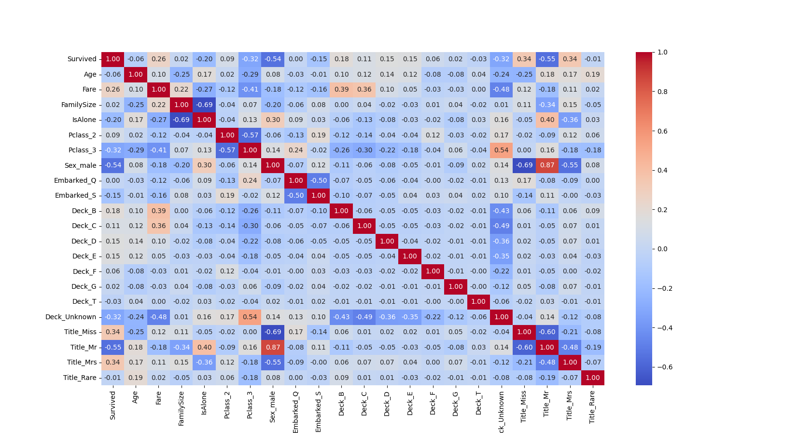

# Titanic Dataset Heatmap

This code reads the Titanic dataset, performs some data preprocessing and feature engineering, and then creates a heatmap to visualize the correlation between the features and the target variable (Survived)

# Getting Started

To run the provided Python code in Visual Studio Code (VSCode), follow these steps:

1. Install Python on your computer if you haven't already. Download the installer from the official Python website (https://www.python.org/downloads/) and follow the installation instructions.

2. Install Visual Studio Code if you haven't already. Download the installer from the official VSCode website (https://code.visualstudio.com/download) and follow the installation instructions.

3. Install the Python extension for VSCode:

- Open Visual Studio Code.
- Click on the Extensions icon on the left sidebar (or press Ctrl+Shift+X).
- Search for "Python" in the Extensions Marketplace.
- Click on the "Install" button next to the Python extension by Microsoft.

4. Open a new or existing Python file in VSCode:

- To create a new Python file, click on "File" > "New File" (or press Ctrl+N), then click on "File" > "Save As" (or press Ctrl+Shift+S), and save the file with a .py extension (e.g., titanic_analysis.py).
- To open an existing Python file, click on "File" > "Open File" (or press Ctrl+O), and select the Python file you want to open.

5. Copy the provided Python code into the Python file you created or opened in VSCode.

6. Make sure you have the Titanic dataset (CSV file) in the same directory as your Python file. If you don't have the dataset, download it from a source like Kaggle (https://www.kaggle.com/c/titanic/data) and save it in the same directory as your Python file.

7. Ensure the Python interpreter is set correctly in VSCode:

- In the bottom-left corner of the VSCode window, you should see the Python interpreter version (e.g., "Python 3.9.7 64-bit"). If it's not there or incorrect, click on it to open the "Select Interpreter" command, and choose the correct Python interpreter from the list.

8. Run the code:

- Click on the "Run" icon in the top-right corner of the VSCode window (or press Ctrl+Alt+N if you have the Code Runner extension installed) to run the code.
- Alternatively, you can run the code from the terminal within VSCode. Open the terminal by clicking on "Terminal" > "New Terminal" (or press Ctrl+` ). In the terminal, type python <your_python_file.py> (e.g., python titanic_analysis.py) and press Enter.

After following these steps, the code should execute, and the heatmap visualization will appear in a separate window, displaying the correlation between the features and the target variable (Survived) in the Titanic dataset.

# Evaluvation

This code reads the Titanic dataset, performs some data preprocessing and feature engineering, and then creates a heatmap to visualize the correlation between the features and the target variable (Survived). Here's an evaluation of the code and its output:

Data Preprocessing:

- The code fills missing values in the 'Age' column with the median age.
- It fills missing values in the 'Embarked' column with the mode.
- It fills missing values in the 'Fare' column with the median fare for each passenger class.

Feature Engineering:

- It combines 'SibSp' and 'Parch' columns into a new 'FamilySize' column.
- It creates a new 'IsAlone' column, which is 1 if the passenger is alone and 0 otherwise.
- It extracts deck information from the 'Cabin' column and creates a new 'Deck' column.
- It extracts titles from the 'Name' column and creates a new 'Title' column, replacing rare titles with more common ones.
- It drops unnecessary columns like 'PassengerId', 'Name', 'Ticket', 'Cabin', 'SibSp', and 'Parch'.
- It one-hot encodes categorical variables like 'Pclass', 'Sex', 'Embarked', 'Deck', and 'Title'.

Heatmap Visualization:

- The code generates a heatmap using Seaborn to visualize the correlation between the features and the target variable 'Survived'.
- The heatmap displays a color-coded matrix with correlation coefficients ranging from -1 to 1.
- Cool colors (e.g., blue) represent positive correlations, while warm colors (e.g., red) represent negative correlations. The intensity of the color indicates the strength of the correlation.

Evaluation:

- The heatmap provides insights into the relationships between the input features and the target variable 'Survived'. By observing the heatmap, you can identify which features have the strongest correlations with the target variable.
- The preprocessing and feature engineering steps in the code help to address missing values, create new features, and transform categorical variables, which can improve the performance of machine learning models.
- This code is a good starting point for exploratory data analysis and feature selection. However, it does not train or evaluate a machine learning model. To predict passenger survival, you would need to split the data into training and testing sets, train a model, and evaluate its performance using appropriate metrics, such as accuracy, precision, recall, or F1 score.

In summary, this code preprocesses the Titanic dataset, performs feature engineering, and visualizes the correlation between features and the target variable using a heatmap. This can help you understand the relationships between variables and select the most relevant features for building a machine learning model to predict passenger survival.
